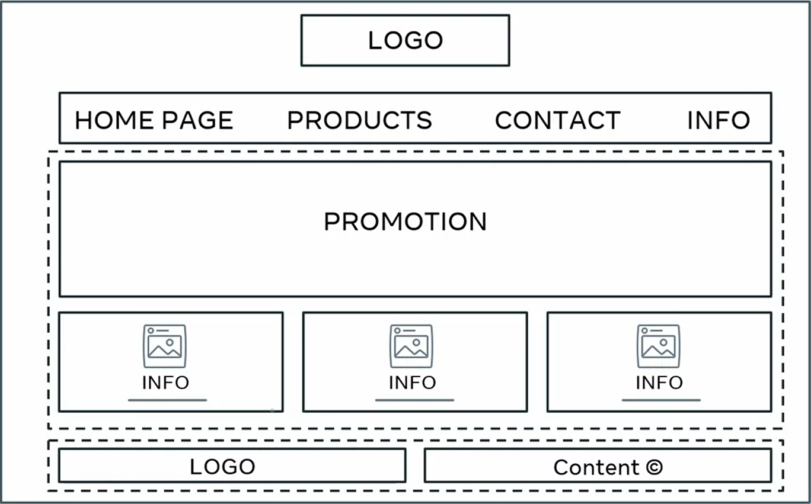
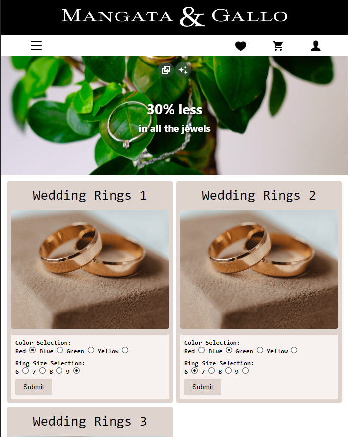

# Proyecto final del curso HTML y CSS en detalle

El curso de HTML y CSS en detalle es parte de una serie de cursos para obtener el Certificado profesional de Desarrollador front-end de Meta.

Este proyecto consiste en crear una web básica basada en un boceto dado. Además, he agregado un diseño responsive basado en el enfoque "mobile first", donde primero he realizado el diseño para dispositivos móviles con una pequeña funcionalidad de menú hamburguesa, y luego realicé pequeñas correcciones para tabletas y ordenadores.

## Bosquejo

## Versión móvil

## Versión de escritorio

